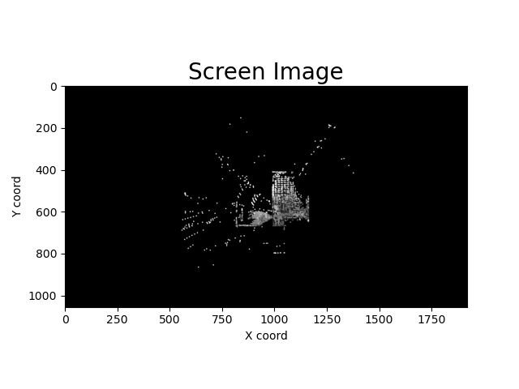
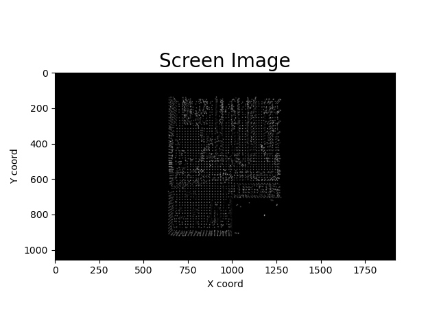
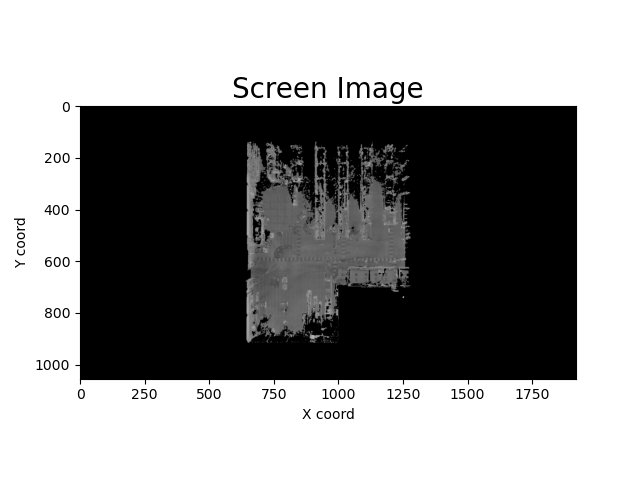
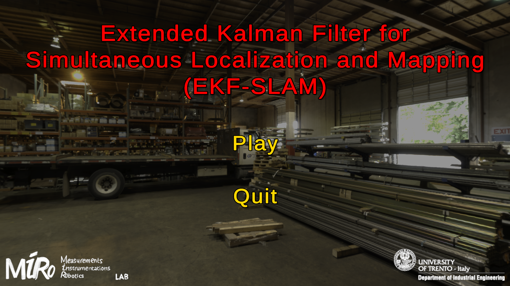
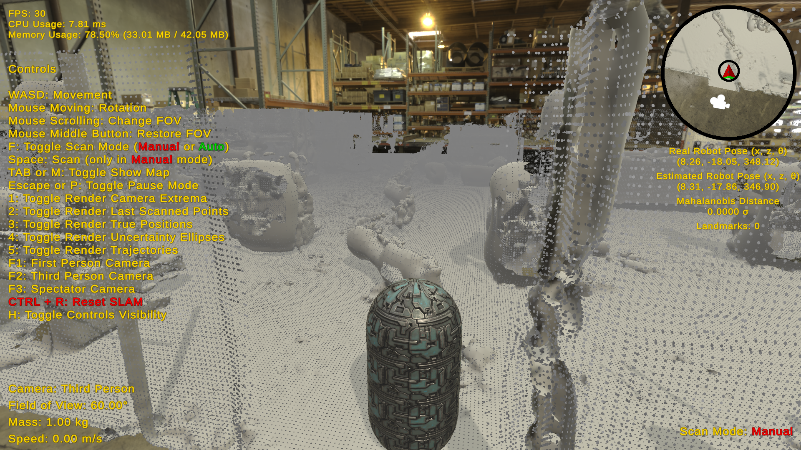
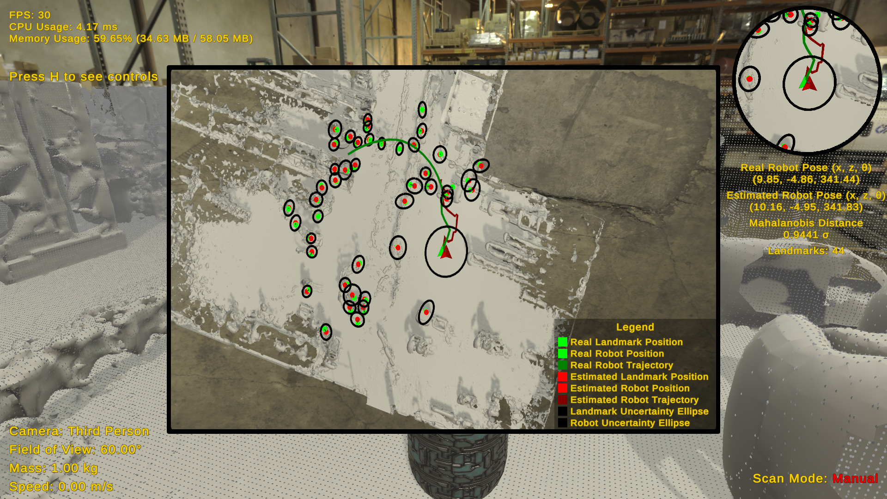

# Robotic Perception - Extended Kalman Filter for Simultaneous Localization and Mapping (EKF-SLAM)

## Table of Contents
1. [Project Overview](#1-project-overview)
2. [Features](#2-features)
3. [Development Tools](#3-development-tools)
4. [Visual Journey](#4-visual-journey)
5. [Implementation Highlights](#5-implementation-highlights)
6. [Demo](#6-demo)
7. [Bibliography](#7-bibliography)
8. [Authors](#8-authors)

## 1. Project Overview

This project was initially developed for submission in **[Robotic Perception and Action](https://www.miro.ing.unitn.it/)** course at **[University of Trento](https://www.unitn.it/en)**. It consists of two subprojects, each discussed in the following subsections from different perspectives.

### 1.1 Python Project

The project aims to enhance point cloud data through cropping, downsampling, and outlier removal in order to create high-quality meshes for Simultaneous Localization and Mapping (SLAM) applications. It incorporates three surface reconstruction algorithms (Ball-Pivoting, Poisson Surface, and Alpha Shape), with Poisson Surface Reconstruction emerging as the most effective choice. This algorithm is then used to process a large and noisy point cloud from a .txt file, generating a mesh for [Unity Game Engine](https://unity.com/), enabling SLAM within a virtual environment.

### 1.2 Unity Project

This Unity project implements EKF-SLAM using the mesh from the previous project, which represents a warehouse. The user controls a capsule rigid body equipped with a scanning camera that generates a point cloud through raycasting. The Density-Based Spatial Clustering of Applications with Noise (DBSCAN) clustering algorithm processes the point cloud, identifying landmarks as centroids of output clusters. Data association relies on the minimum Euclidean distance between these centroids. The program executes prediction and update steps for every frame and scan, respectively. The motion model computes the next position using the motion delta, while the prediction model utilizes range-bearing measurements. The minimap, as well as a larger one, displays true/estimated positions, uncertainty ellipses, and trajectories. Various parameters, including noise components, are configurable in the Editor of Unity Game Engine.

## 2. Features

### 2.1 Python Project
- **Converting**: Text File (TXT) to Point Cloud Data (PCD)
- **PCD Preprocessing**: Removing Outliers, Reducing Density, Cropping Shape
- **Surface Reconstruction**: Ball Pivoting, Poisson Surface, Alpha Shape
- **Visualize Geometries**: PCD, Mesh

### 2.2 Unity Project
- **Main Algorithm**: Extended Kalman Filter for Simultaneous Localization and Mapping (EKF-SLAM)
- **Clustering**: Density-Based Spatial Clustering of Applications with Noise (DBSCAN)
- **Mahalanobis Distance**: Real Pose vs Estimated Pose
- **Performance Monitor**: FPS, CPU Usage, Memory Usage
- **Design Patterns**: Singleton, Builder, Observer
- **Unity Features**: Scenes, Menu System, Camera System, Raycasting, Minimap, Skybox, Shaders

## 3. Development Tools

### 3.1 Python Project
- **Language**: Python 3.10.13
- **IDE**: PyCharm 2023.2.5
- **Libraries**:
    - **[Open3D](https://www.open3d.org/)**: Responsible for handling operations related to preprocessing point clouds and transforming them into meshes.
    - **[Pandas](https://pandas.pydata.org/)**: Data manipulation and analysis library, providing versatile data structures and tools.
    - **[Numpy](https://numpy.org/)**: Support for large, multi-dimensional arrays and matrices, fundamental for scientific computing.
    - **[Matplotlib](https://matplotlib.org/)**: A comprehensive plotting library used for creating high-quality visualizations.

### 3.2 Unity Project
- **Language**: C# 9.0
- **IDE**: Visual Studio 2022
- **Platform**: Unity 2022.3.19f1 (LTS)
- **Packages**:
    - **[Pcx](https://github.com/keijiro/Pcx)**: Custom importer and renderer enabling the handling of point cloud data in Unity.
    - **[TextMesh Pro](https://docs.unity3d.com/Manual/com.unity.textmeshpro.html)**: Replacement for Unity's UI Text and legacy Text Mesh, offering high-quality text rendering.
    - **[NuGet](https://github.com/GlitchEnzo/NuGetForUnity)**: Package manager facilitating the importation of .NET libraries to Unity, such as MathNet.Numerics.
    - **[MathNet.Numerics](https://numerics.mathdotnet.com/)**: Provides a wide range of functionalities, including linear algebra and analysis.

## 4. Visual Journey

This section illustrates each step involved in both projects visually.

### 4.1 Python Project

#### Step 0: Point cloud before preprocessing.



#### Step 1: Point cloud after preprocessing.



#### Step 2: Final mesh generated from the processed point cloud.



### 4.2 Unity Project

#### State 0: Main menu right after launching the program.



#### State 1: Initial state of the capsule rigid body.



#### State 2: EKF-SLAM's state after some measurements.



## 5. Implementation Highlights

### 5.1 Python Project

**Highlight 1/3**: Importing input file as a point cloud data (PCD). This algorithm is used in the function that converts text files into PCD.
```python
def import_pcd(input_file_path, downsampling_voxel_size: float = 0.0, denoise: bool = True):
    pcd = None

    # txt is not supported by open3d, therefore some manual setups are required
    is_txt = path.splitext(input_file_path)[1] == ".txt"
    if is_txt:
        # (x, y, z): 3D position
        # (i): normalized intensity (color, in grayscale, between 0 and 1)
        column_names = ['x', 'y', 'z', 'd', 'i']
        data_types = {'x': np.float32, 'y': np.float32, 'z': np.float32, 'd': np.float32, 'i': np.float32}
        data_frame = pd_read_csv(input_file_path, names=column_names, dtype=data_types, delim_whitespace=True)

        # Stack position and color arrays after each other to convert them into suitable inputs for open3d
        points = np.vstack((data_frame.x, data_frame.y, data_frame.z)).transpose()
        colors = np.vstack((data_frame.i, data_frame.i, data_frame.i)).transpose()

        # Create the geometry (point cloud data) with open3d:
        #   the points and their associated colors (grayscale) are provided in the input file
        #   the normals, however, are not provided, therefore estimation is needed (below)
        pcd = o3d_geo.PointCloud()
        pcd.points = o3d_uti.Vector3dVector(points)
        pcd.colors = o3d_uti.Vector3dVector(colors)
    else:
        pcd = o3d_io.read_point_cloud(input_file_path)

    # Denoise PCD
    if denoise:
        util.denoise_pcd(pcd)

    # Downsample PCD if necessary (resulting in less points)
    if downsampling_voxel_size > 0.0:
        pcd = pcd.voxel_downsample(downsampling_voxel_size)

    # Assuming the normals are not given, thus calculation is required
    if is_txt:
        # Fits a plane for every point to calculate the normal:
        #   10cm search radius, considers up to 30 nearest neighbors
        pcd.estimate_normals(search_param=o3d_geo.KDTreeSearchParamHybrid(radius=0.1, max_nn=30))

        # Normals might not be consistently oriented:
        #   propagates the normal orientation using a minimum spanning tree
        # Warning: computationally heavy (memory & time)!
        # pcd.orient_normals_consistent_tangent_plane(10)

    return pcd
```

**Highlight 2/3**: Converting a point cloud (PCD) file to a mesh, providing options for downsampling, denoising, and choosing the reconstruction algorithm.
```python
def pcd_to_mesh(pcd_input_file_path: str = "./Assets/balyo_wh_cropped.pcd",
                mesh_output_file_path: str = "./Assets/balyo_wh_cropped.obj",
                reconst_algorithm: SRAlg = SRAlg.BALL_PIVOTING,
                pcd_downsampling_voxel_size: float = 0.0,
                denoise: bool = True,
                binary_output: bool = True,
                visualize_result: bool = True):
    # -------------------- Step 1: Import PCD --------------------
    # Import and downsample the PCD to make it less dense (if pcd_downsampling_voxel_size > 0.0)
    pcd = io.import_pcd(pcd_input_file_path, pcd_downsampling_voxel_size, denoise)

    # -------------------- Step 2: Create Mesh --------------------
    mesh = None
    match reconst_algorithm:
        case SRAlg.BALL_PIVOTING:
            mesh = meshifier.bpa(pcd)
        case SRAlg.POISSON_SURFACE:
            mesh = meshifier.poisson_surface(pcd)
        case SRAlg.ALPHA_SHAPE:
            mesh = meshifier.alpha_shape(pcd)
        case _:
            mesh = meshifier.bpa(pcd)

    # -------------------- Step 3: Export Mesh --------------------
    io.export_mesh(mesh, mesh_output_file_path, denoise, binary_output)

    # -------------------- Step 4: Visualize Mesh (if needed) --------------------
    if visualize_result:
        visualize_by_path([mesh_output_file_path])
```

**Highlight 3/3**: Performing Poisson Surface Reconstruction combined with bounding box cropping to create the final mesh of the warehouse.
```python
def poisson_surface(pcd):
    poisson_mesh, densities = o3d_geo.TriangleMesh.create_from_point_cloud_poisson(
        pcd, depth=10, width=0, scale=1.1, linear_fit=False, n_threads=12
    )

    # Remove points where the density does not reach a certain threshold
    vertices_to_remove = densities < np.quantile(densities, 0.05)
    poisson_mesh.remove_vertices_by_mask(vertices_to_remove)

    poisson_mesh.compute_vertex_normals()

    # Crop mesh to the axis aligned bounding box of PCD
    bounding_box = pcd.get_axis_aligned_bounding_box()
    poisson_mesh_cropped = poisson_mesh.crop(bounding_box)

    return poisson_mesh_cropped
```

### 5.2 Unity Project

**Highlight 1/5**: Declaration of variables used in EKF-SLAM.
```csharp
// Singleton instance
public static SLAMManager Instance { get; private set; }

// State vector and state covariance matrix
private Vector<float> stateVector;
private Matrix<float> stateCovarianceMatrix;
private List<Landmark> landmarks;

// Motion model related variables
private Matrix<float> motionModelJacobian;
private Matrix<float> motionNoiseCovarianceMatrix;

// Measurement model related variables
private Matrix<float> predictedMeasurementModelJacobian;
private Matrix<float> actualMeasurementNoiseCovarianceMatrix;

// Store the robot's last pose (x, z, yaw) due to simplified and accurate motion model calculation
private Vector<float> lastRealRobotPose;

// Keep track whether prediction and/or update steps were executed in the current frame
private bool predictionStepDirty = false;
private bool updateStepDirty = false;

// Normal distribution sampler for modeling the noise associated with each variable
private NoiseSampler noiseSampler;

// Robot's position visualizer on minimap: real poisition, estimated position, connecting line between them and their uncertainty ellipse
private PositionVisualizer robotPositionVisualizer;
```

**Highlight 2/5**: Prediction step of EKF-SLAM. The next state is calculated based on the motion delta, and the state vector is updated along with its covariance matrix.
```csharp
void EKF_SLAM_Prediction()
{
    CalculatePredictedState( out Vector<float> predictedState );

    // Update robot pose estimate (first 3 coordinates of state vector)
    stateVector[ 0 ] = predictedState[ 0 ];
    stateVector[ 1 ] = predictedState[ 1 ];
    stateVector[ 2 ] = predictedState[ 2 ];

    // Update robot pose covariance (only the top 3x3 submatrix)
    stateCovarianceMatrix = motionModelJacobian * stateCovarianceMatrix * motionModelJacobian.Transpose() + motionNoiseCovarianceMatrix;

    predictionStepDirty = true;
}
```

**Highlight 3/5**: The Update step in EKF-SLAM begins with a scan from the time-of-flight camera. Subsequently, landmarks are calculated using the DBSCAN clustering algorithm. For each new landmark, a data association process is executed. Finally, the Kalman gain is computed, and the state vector, along with its covariance matrix, undergoes an update based on the innovation (the discrepancy between actual and predicted measurement) weighted by the Kalman gain.
```csharp
void EKF_SLAM_Update()
{
    // Perform measurements by scanning
    tofCamera.Scan();

    // Calculate the current landmarks based on the measurements
    CalculateLandmarks( out List<Landmark> currentLandmarks );
    if( currentLandmarks.Count == 0 ) return; // No landmarks have been found, so there is nothing to update

    int landmarkCountBeforeUpdate = landmarks.Count;
    for( int i = 0; i < currentLandmarks.Count; i++ )
    {
        Landmark currentLandmark = currentLandmarks[ i ];

        // Data association step: check whether the measured landmark has been observed before
        int landmarkIndex = DataAssociation( currentLandmark );
        currentLandmark.IsNewlyObserved = landmarkIndex == -1;
        if( currentLandmark.IsNewlyObserved )
        {
            landmarks.Add( currentLandmark );
            landmarkIndex = landmarks.Count - 1;         
        }
        else
        {
            // Clear the visual representations of already observed landmarks as they are already on the map
            currentLandmark.Clear();
        }

        // Calculate actual measurement
        CalculateActualMeasurement( currentLandmark.IsNewlyObserved, landmarkIndex, out Vector<float> actualMeasurement );

        if( currentLandmark.IsNewlyObserved )
        {
            InitializeNewLandmark( landmarkIndex, actualMeasurement );
        }

        // Calculate predicted measurements
        CalculatePredictedMeasurement( landmarkIndex, out Vector<float> predictedMeasurement );

        // Calculate innovation (discrepancy between actual and predicted measurement)
        Vector<float> innovation = actualMeasurement - predictedMeasurement;
        innovation[ 1 ] = Utils.NormalizeAnglePI( innovation[ 1 ] );

        // Calculate covariance matrices for Kalman gain
        Matrix<float> crossCovarianceMatrix = stateCovarianceMatrix * predictedMeasurementModelJacobian.Transpose();
        Matrix<float> predictedMeasurementNoiseCovarianceMatrix = predictedMeasurementModelJacobian * stateCovarianceMatrix * predictedMeasurementModelJacobian.Transpose();
        Matrix<float> totalNoiseCovarianceMatrix = predictedMeasurementNoiseCovarianceMatrix + actualMeasurementNoiseCovarianceMatrix;

        if( totalNoiseCovarianceMatrix.Determinant() > Constants.Epsilon )
        {
            // Calculate Kalman gain
            Matrix<float> kalmanGain = crossCovarianceMatrix * totalNoiseCovarianceMatrix.Inverse();

            // Update state vector
            Vector<float> stateCorrection = kalmanGain * innovation;
            stateVector = stateVector + stateCorrection;
            stateVector[ 2 ] = Utils.NormalizeAnglePI( stateVector[ 2 ] );

            // Update state covariance matrix
            Matrix<float> covarianceCorrectionMatrix = ( Utils.CreateIdentity( stateCovarianceMatrix.RowCount ) - kalmanGain * predictedMeasurementModelJacobian );
            stateCovarianceMatrix = covarianceCorrectionMatrix * stateCovarianceMatrix;
        }

        // Modify the measurement Jacobian so that the dynamically indexed variables are set to zero (makes the calculation easier in the next update)
        predictedMeasurementModelJacobian[ 0, 3 + 2 * landmarkIndex ] = 0;
        predictedMeasurementModelJacobian[ 0, 3 + 2 * landmarkIndex + 1 ] = 0;
        predictedMeasurementModelJacobian[ 1, 3 + 2 * landmarkIndex ] = 0;
        predictedMeasurementModelJacobian[ 1, 3 + 2 * landmarkIndex + 1 ] = 0;
    }

    // New landmarks, once observed, will not be flagged as newly observed in subsequent sets of measurements, allowing them to be used in data association
    for( int i = landmarkCountBeforeUpdate; i < landmarks.Count; i++)
    {
        Landmark modifiedLandmark = landmarks[ i ];
        modifiedLandmark.IsNewlyObserved = false;
        landmarks[ i ] = modifiedLandmark;
    }

    updateStepDirty = true;
}
```

**Highlight 4/5**: The process of calculating the predicted measurement from the state estimation. It is based on range-bearing measurements and their first-order Taylor expansion, as the model is non-linear.
```csharp
void CalculatePredictedMeasurement( int landmarkIndex, out Vector<float> predictedMeasurement )
{
    // Calculate the estimated range and bearing of the landmark with respect to estimated robot pose
    Vector<float> distance2D = GetEstimatedLandmarkPosition( landmarkIndex ) - GetEstimatedRobotPosition();
    float rangeSquared = distance2D.DotProduct( distance2D );
    float range = Mathf.Sqrt( rangeSquared );
    float bearing = Mathf.Atan2( distance2D[ 1 ], distance2D[ 0 ] ) - GetEstimatedRobotPose()[ 2 ];
    bearing = Utils.NormalizeAnglePI( bearing );

    // First row
    predictedMeasurementModelJacobian[ 0, 0 ] = -range * distance2D[ 0 ];
    predictedMeasurementModelJacobian[ 0, 1 ] = -range * distance2D[ 1 ];
    predictedMeasurementModelJacobian[ 0, 2 ] = 0;
    predictedMeasurementModelJacobian[ 0, 3 + 2 * landmarkIndex ] = range * distance2D[ 0 ];
    predictedMeasurementModelJacobian[ 0, 3 + 2 * landmarkIndex + 1 ] = range * distance2D[ 1 ];

    // Second row
    predictedMeasurementModelJacobian[ 1, 0 ] = distance2D[ 1 ];
    predictedMeasurementModelJacobian[ 1, 1 ] = -distance2D[ 0 ];
    predictedMeasurementModelJacobian[ 1, 2 ] = -rangeSquared;
    predictedMeasurementModelJacobian[ 1, 3 + 2 * landmarkIndex ] = -distance2D[ 1 ];
    predictedMeasurementModelJacobian[ 1, 3 + 2 * landmarkIndex + 1 ] = distance2D[ 0 ];

    // Coefficient
    if( rangeSquared > 0.0f ) predictedMeasurementModelJacobian /= rangeSquared;

    // No need to add noise here as that is already incorporated in the state vector
    predictedMeasurement = Vector<float>.Build.Dense( 2 );
    predictedMeasurement[ 0 ] = range;
    predictedMeasurement[ 1 ] = Utils.NormalizeAnglePI( bearing );
}
```

**Highlight 5/5**: This function implements the core of DBSCAN algorithm inside the DBSCAN class. It clusters a list of 3D vectors based on a specified epsilon radius and minimum number of points. Additionaly, it assigns cluster labels to each data point and identifies core, border, and noise points within the dataset.
```csharp
static int[] Cluster( List<Vector3> data, float epsilon, int minPoints )
{
    // Store cluster labels for each data point
    int[] labels = new int[ data.Count ];
    int clusterIdx = 0;

    for( int i = 0; i < data.Count; i++ )
    {
        // Skip already assigned (visited) points
        if( labels[ i ] != 0 ) continue;

        // Get neighbors within the Epsilon radius
        List<int> neighbors = GetNeighbors( data, i, epsilon );

        if( neighbors.Count >= minPoints )
        {
            // The current point is a core point as it has enough neighbors, so expand the cluster
            clusterIdx++;
            ExpandCluster( data, labels, i, neighbors, clusterIdx, epsilon, minPoints );
        }
        else
        {
            // The current point is a noise point as it does not have enough neighbors
            labels[ i ] = Noise;
        }
    }

    return labels;
}
```

## 6. Demo

The project is not uploaded. However, builds are available for Linux (x86_64) and Windows (x86), which can be downloaded [here](https://drive.google.com/drive/folders/1oFx_F5WAaQxsaC6HdMGzzOeTlxDHSbmA?usp=sharing).

## 7. Bibliography

The implementation details were based on the [EKF-SLAM lecture](http://ais.informatik.uni-freiburg.de/teaching/ws12/mapping/pdf/slam04-ekf-slam.pdf) by Professor Cyrill Stachniss.

## 8. Authors

- Ferenc Szendrei

[Back to Top](#robotic-perception---extended-kalman-filter-for-simultaneous-localization-and-mapping-ekf-slam)

